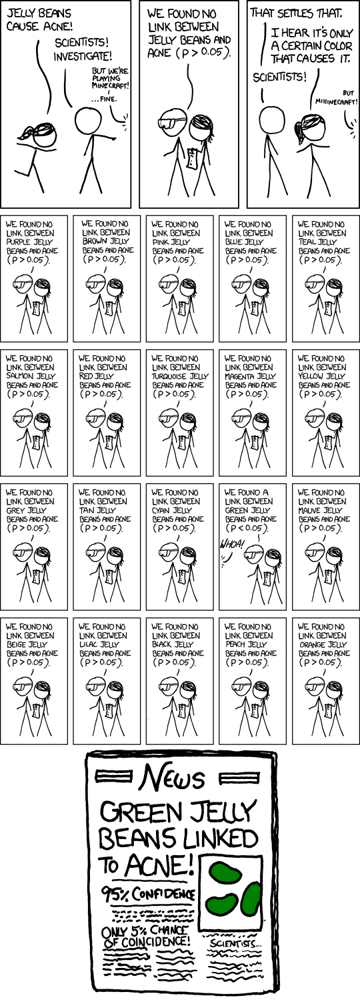
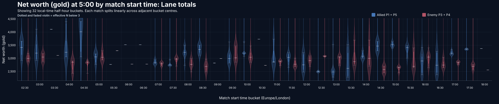
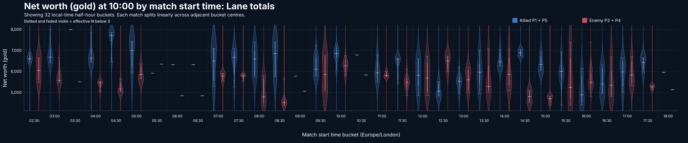
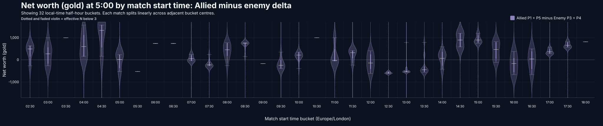
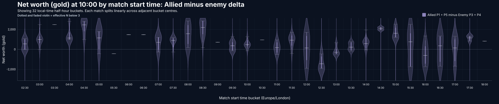

# STRATZ Dota analysis scripts

Do not run code you do not trust and/or do not understand, including this code. Read it first, keep secrets out of shared files, and ask someone you trust when a command or permission request looks wrong.

This repo contains three Python scripts for digging through your STRATZ match history and some helper boilerplate you're welcome to use for your own scripts.

1. `item_winrate.py` compares results when a hero did and did not buy an item. It checks purchase events, not final inventory.
2. `lane_gold.py` compares net worth at 5 and 10 minutes by local match start time. It can compare a lane matchup or both whole teams.
3. `match_diary.py` opens an autosaving localhost browser diary for ranked games in the last 12 hours and keeps games that receive diary content.

The example and "factory default" settings use [some random noob with zero Tyrian Regalia I picked at random.](https://stratz.com/players/321580662-yatoro/), Nature's Prophet (hero 53), and Mjollnir (item 158).

## Statistical caution

Treat these reports as clues, not proof. A worse lane result at a certain time does not mean the clock caused it: that time might coincide with the start of a session, late-session fatigue, a patch, different teammates, a small run of difficult opponents, or countless other factors. Even an unfaded bucket often has a modest sample, and checking many buckets makes a chance-looking result more likely. Avoid making a serious decision from one graph without a stronger study that tests competing explanations.



*[Significant, XKCD 882](https://xkcd.com/882/) by Randall Munroe. Reproduced under the [Creative Commons Attribution-NonCommercial 2.5 License](https://creativecommons.org/licenses/by-nc/2.5/). The comic is not covered by this repository's MIT License.*

## Contents

1. [Quick start](#quick-start)
2. [Windows](#windows)
3. [macOS and Linux](#macos-and-linux)
4. [Match diary](#match-diary)
5. [Common commands](#common-commands)
6. [Choosing games or months](#choosing-games-or-months)
7. [Filtering by weekday](#filtering-by-weekday)
8. [Lane and team comparisons](#lane-and-team-comparisons)
9. [Reading the weighted statistics](#reading-the-weighted-statistics)
10. [Finding hero and item IDs](#finding-hero-and-item-ids)
11. [Private match data](#private-match-data)
12. [Cache and privacy](#cache-and-privacy)
13. [Example output](#example-output)
14. [Dependency safety](#dependency-safety)
15. [Adding another analysis script](#adding-another-analysis-script)
16. [Data source and license](#data-source-and-license)
17. [Troubleshooting](#troubleshooting)

## Quick start

1. Install Python 3.10 or newer. Python 3.11 or newer is recommended.
2. Copy `config.example.json` to a new file called `config.json`.
3. Get a token from [stratz.com/api](https://stratz.com/api).
4. Put the token in the top-level `api_key` setting in `config.json`.
5. Run a program using the instructions for your operating system below.

Git ignores `config.json` because it contains your token. Do not publish it.

## Windows

Double-click `prep_terminal.bat`. It creates a private Python environment, installs timezone data if needed, checks your config, and leaves a ready command window open.

Try any command:

```bat
python .\lane_gold.py
python .\item_winrate.py
python .\match_diary.py
```

If Windows cannot find `py`, install Python from [python.org](https://www.python.org/downloads/). Tick **Add Python to PATH** during setup.

## macOS and Linux

Open a terminal in this folder and run:

```sh
python3 -m venv .venv
. .venv/bin/activate
python -m pip install --require-hashes -r requirements.lock
python lane_gold.py
python match_diary.py
```

Most Linux installations already include timezone data, so the `tzdata` install may not be needed.

The macOS and Linux instructions have not been tested by the author. If a problem appears to be specific to your operating system, please open an issue or submit a pull request with the fix.

## Match diary

Run `python match_diary.py` to fetch the configured player's ranked matches from the last 12 hours, load older saved entries, start a private loopback-only web server, and open the diary in the default browser. Its stable default address is `http://127.0.0.1:8765/dota-match-diary/`; `browser_port` and `browser_path` can change those two parts. It uses the browser already installed on the machine—no Chromium, Electron, or web framework is bundled. A new browser window is requested by default; use `--browser-tab` or set `match-diary.browser_mode` to `tab` for a tab instead. `--no-browser` starts only the server and prints the same local URL.

Every change is saved after a short typing debounce; there is no Save or Submit button. `Ctrl+Z`, `Ctrl+Y`, the toolbar buttons, whole-game clearing, and whole-player clearing are supported. A slider labelled **Skip** has no stored rating yet. Clicking or dragging it automatically clears Skip and records the snapped value—even when the first click leaves it at the centre. Click Skip again to discard the rating without disabling the slider. Every slider is 1–5 and starts skipped. Match outcome, overall/early/mid/late fun, and miscellaneous match comments are grouped at the top of the form.

The browser UI respects the shared `dark_mode` setting; `--light-mode` provides the corresponding light palette for a one-off launch.

Each player also has separate 1–5 Doomism ratings for chat and gameplay, **Avoid** and **Friended** checkboxes, a 1–5 comms-frequency slider (`1` means completely silent, including no pings or map drawing), and a 1–5 mute-likelihood slider from **Not muted** through **Suspected** to **Probably muted**. Every player is shown directly in the Allies or Enemies tab—there is no player dropdown.

Player cards show whether STRATZ identifies the profile as public or private. Public profiles have an on-demand **Check main role** action. It scans up to the latest 50 ranked games that contain explicit numbered-role data, shows only the modal role and the percentage of that sample played in it, and flags **Token farming** when that main role differs from the role played in the diary match. Private profiles instead provide a manual **Token farming?** checkbox. Full and text exports include this boolean; export also forces it true whenever a completed public-profile check found a different main role.

The match list uses the overall-fun diary value as a compact marker: `😫`, `🙁`, `😐`, `🙂`, or `😄` for 1–5. A non-empty diary whose overall fun remains skipped shows `⏭️`; a match with no diary content has no marker and uses a reddish background so unreviewed games stand out. Bundled hero icons appear beside hero names without making an internet request while the diary is running.

Use **Add match ID…** to fetch a particular older match containing the configured player and select it immediately. The explicit target is allowed outside the normal 12-hour discovery window; like a recent match, it becomes permanent when diary data is first entered. The sidebar can be ordered by match time (the default), when each diary was first started, or its latest update. The adjacent arrow flips between newest-first and oldest-first. `match-diary.sort_by` and `match-diary.sort_descending` set the initial controls; LLM exports follow the selected order.

For a long-running server, **Check for new games** repeats the rolling query with deliberate overlap, so it can catch both newly completed games and matches STRATZ parsed after the previous check. **Extend window +1h** grows that rolling search window by an hour and queries immediately. Extensions last for the current session; they do not silently rewrite `config.json`. Startup, refresh, extension, and explicit-ID STRATZ requests run in background threads.

Autosave also runs entirely away from the browser/request path. Rapid changes are coalesced by match so only the newest snapshot waits to be written; one serial writer performs the atomic disk replacements, including when edits arrive during an active save.

Days are calendar-aware. Weekends use a blue day heading, UK bank holidays use amber, and EU national public holidays use purple. EU days show the actual flag emoji for every selected member state whose whole country has a public holiday, such as `🇫🇷 🇩🇪 🇮🇹`; selecting the day spells out the countries and holiday names. A UK-and-EU overlap has its own colour. The default UK region is England (`GB-ENG`); use `GB-WLS`, `GB-SCT`, or `GB-NIR` in the `match-diary` config block when appropriate. `eu_holiday_countries` accepts `all` or a comma-separated subset of EU country codes.

Holiday dates come from the public Nager.Date country/year API and are cached for seven days under the configured cache directory. Requests contain only a year and country code—never a player ID, match, token, or diary text. If a refresh fails, stale cached dates remain usable and the browser UI reports a warning.

The diary file defaults to `dota_output/match-diary/diary.json`, which is excluded from Git with the rest of `dota_output`. Back it up if the entries matter to you. Recent games without diary content are session-only; a game becomes permanent as soon as any comment, rating, fun score, or comeback/throw flag is entered. Clearing its final field removes it from persistent storage, although it remains visible until it is older than the recent window.

**Export for LLM…** creates Markdown or JSON and independently controls gameplay detail (`none`, `summary`, or `full`) and diary detail (`none`, `text`, or `full`). Full gameplay can be large because it includes the broad raw STRATZ response; summary is the useful default for most prompts.

Factory/example defaults still use player `321580662`. To use factory settings without `config.json`, pass the token and player explicitly:

```text
python match_diary.py -F --api-key YOUR_TOKEN --player-id YOUR_DOTA_ACCOUNT_ID
```

## Common commands

```text
python lane_gold.py
python lane_gold.py -D
python item_winrate.py
python item_winrate.py -D --hero-id "nature's prophet" --item-id mjolnir
python lane_gold.py -D --match-count 250
python lane_gold.py --help
python item_winrate.py --help
```

Running without `-D` loads `config.json` and opens a numbered settings review. Running with `-D` loads the same config and starts immediately.

Use `-F` or `--factory-settings` to ignore `config.json`. That also ignores the token inside it, so add `--api-key YOUR_TOKEN` for that run. Options typed on the command line always win over config and factory settings.

Use `--no-tutorials` to hide tips. Real errors still appear.

Most settings sit at the top level of `config.json`. The `item-winrate`, `lane-gold`, and `match-diary` objects contain only overrides specific to those tools. If the same key appears in both places, precedence is **CLI option > selected tool block > top-level setting > factory setting**.

Dark reports and graphs are the default. Use `--light-mode` for one run, or set the top-level `dark_mode` setting to `false`. The opposite override is `--dark-mode`.

## Choosing games or months

Both analysis programs normally use a target number of qualifying games. The example config asks for 150. The program may scan more history entries to find that many after hero, mode, role, and other filters are applied.

To use every qualifying game from a time window instead:

```text
python lane_gold.py -D --sample-by months --months 24
python item_winrate.py -D --sample-by months --start 2025-01-01 --end 2025-12-31
```

`sample_by` decides which limit is active. If both `match_count` and `months` exist without an explicit choice, the program uses games and shows a tip explaining why.

## Filtering by weekday

All seven local days are included unless you use `--days` or set the top-level `days` setting. The filter uses the report timezone, including daylight-saving changes.

```text
python lane_gold.py -D --days MWF
python lane_gold.py -D --days weekends
python item_winrate.py -D --days work
python lane_gold.py -D --days Tu-Th
python lane_gold.py -D --days all
```

Full names, unambiguous parts of names, and common aliases work. Commas, spaces, `/`, and `+` can join separate days. `T` alone is rejected because it could mean Tuesday or Thursday; use `Tu` or `Th`.

## Lane and team comparisons

Lane mode uses only positions that STRATZ explicitly reports. It does not guess roles.

1. P1 and P5 compare allied P1 plus P5 with enemy P3 plus P4.
2. P3 and P4 reverse that view, comparing allied P3 plus P4 with enemy P1 plus P5.
3. P2 compares allied P2 with enemy P2.

Examples:

```text
python lane_gold.py -D --comparison-mode lane --position P3
python lane_gold.py -D --comparison-mode lane --position P2
python lane_gold.py -D --comparison-mode team --position P4
python lane_gold.py -D --comparison-mode team --position none
python lane_gold.py -D --hero-id any --position P1
```

Team mode compares total allied and enemy net worth. A position still works as a filter. With `--position none`, the program accepts suitable matches even when STRATZ has no role data.

`gold_kind` controls the economic value being compared. The default, `networth`, counts unspent gold and the value of held items. Set it to `cash` or use `--gold-kind cash` to compare only unspent gold; that is usually less representative of lane strength because players spend at different times.

The lane program also accepts `--hero-id any` when you want to combine a player's matches across every hero. The item win-rate program still requires one hero because the hero and item pairing is the point of that analysis.

The charts use dotted violins faded by 30% when effective sample size is below 3. Each violin keeps its normal series colour, so allied, enemy, and delta data remain easy to identify. Change the top-level `low_sample_effective_n` setting or use `--no-low-sample-marking` if you prefer something else.

Empty time buckets at the beginning and end of charts and tables are removed by default. Empty buckets between populated ones remain visible. Use `--keep-empty-edges` or set `trim_empty_edge_buckets` to `false` to retain all 48 buckets.

## Reading the weighted statistics

The report gives some matches more influence than others, so its sample sizes need a little explanation.

1. **Newer matches count more.** Matches are sorted newest first, then each older match receives a little less weight than the previous one. `newest_half_share` controls the balance: `0.7` means the newest half of the matches receives 70% of the total influence. This uses match order rather than days, so a long break between matches does not create an extra penalty.

2. **Start times are smoothed.** The day is divided into 48 half-hour slots. A match near the middle of a slot mostly or entirely belongs to that slot; a match near an edge is shared with the neighbouring slot. This avoids a match at 12:59 being treated as completely unrelated to one at 13:01. It also means neighbouring slots overlap and should not be read as independent results.

3. **Effective N is the honest weighted sample size.** The ordinary `n` is how many matches contributed. Effective N asks how many equally weighted matches would contain roughly the same amount of information after recency and time smoothing. Equal weights keep effective N close to `n`; a few dominant matches pull it towards 1. Dotted, faded violins mark effective N below the configured threshold, which defaults to 3.

4. **The median is the centre, not the average.** Half of the weighted results lie on either side of the median. The 25th to 75th percentile span contains the middle half, while the 10th to 90th span shows a broader range. Minima and maxima are useful context but are easily moved by one unusual match.

5. **More data does not remove bias.** Effective N measures the strength of the weighted sample, not whether matchmaking, patches, party composition, session fatigue, or another hidden factor caused the pattern. Use the graph to find questions worth investigating, not to declare that a time of day causes better or worse games.

## Finding hero and item IDs

Names ignore case, spaces, punctuation, and apostrophes. For example, `Nature's Prophet`, `naturesprophet`, and a known alias select the same hero.

```text
python lane_gold.py --list-heroes
python item_winrate.py --list-items
```

The lists come from STRATZ and are cached for 24 hours. Add `--refresh` after a Dota update to fetch them again. In the settings review, type part of a name and choose from the grid. Mouse selection and tab completion vary too much between Windows CMD, PowerShell, macOS, and Linux terminals, so the plain keyboard search works everywhere.

Player, hero, and item names are looked up from their IDs. They are not duplicated in config, so an edited name cannot disagree with its ID.

## Private match data

STRATZ says a signed-in player can access their own full history even if Dota's **Expose Public Match Data** setting was previously disabled. To give this tool the best chance of doing that:

1. Sign in to [STRATZ](https://stratz.com/) using the same Steam account as the player being analysed.
2. While signed in, create or copy the token at [stratz.com/api](https://stratz.com/api).
3. Put that token in your private `config.json` and set `player_id` to your own Dota account ID.
4. Run the tool normally. The token stays on your computer and is sent only to STRATZ.

STRATZ's [own-history description](https://github.com/STRATZ-Esports/knowledge-base/issues/20) is older, so do not treat private-history access as guaranteed forever. If recent matches are missing, sign in to STRATZ first; its [parsing guidance](https://github.com/STRATZ-eSports/knowledge-base/issues/24) says signed-in players receive priority. As a fallback, enable **Expose Public Match Data** in Dota 2, finish a public match, and allow time for STRATZ to backfill. You can disable it again afterward, but future availability depends on Valve and STRATZ. Private custom-lobby matches are a different case and may not be available at all.

## Cache and privacy

Caching is on by default. Each saved GraphQL response includes its query fingerprint and a description of what it contains. A cached partial response is only reused for a compatible query; it is never treated as a complete match.

1. Hero, item, and player names expire after 24 hours.
2. Player history expires after 15 minutes so new games appear soon.
3. Completed match details remain reusable because old matches rarely change.
4. `--refresh` bypasses all cached data and replaces it with fresh responses.
5. `--no-cache` prevents both reading and writing cache files for that run.

The cache lives in `.cache` by default. Git ignores it. Cached match data can contain public account IDs, so check it before sharing it separately.

## Example output

These graphs use Yatoro's 50 most recent qualifying public P1 matches returned by STRATZ across all heroes and lobby types. Empty edge buckets were trimmed; empty gaps inside the observed time range remain visible.





The next pair shows the same games as a single allied-minus-enemy series.





## Dependency safety

The analysis itself uses Python's standard library. Windows needs the small `tzdata` fallback, and PNG export optionally uses CairoSVG.

`pyproject.toml` and `uv.lock` provide the reproducible setup. The lock was resolved with a 14-day dependency cooldown, so brand-new package releases are not selected immediately, and uv's known-malware check is enabled. Run `uv sync` for the normal environment or `uv sync --extra png` for PNG export. The official [uv installation page](https://docs.astral.sh/uv/getting-started/installation/) lists platform-specific installation choices.

Windows users who use `prep_terminal.bat` do not need uv. It installs the pinned `tzdata` release from `requirements.lock` with required SHA-256 hashes. The CI workflow uses the same locked fallback. A cooldown and lock reduce supply-chain risk but cannot prove that a package is safe; review dependency updates before merging them.

Dependabot is prepared for weekly uv and GitHub Actions checks with the same 14-day cooldown. CI actions are pinned to immutable commit IDs rather than movable tags.

## Adding another analysis script

Put the analysis itself in a new file beside `item_winrate.py` and `lane_gold.py`. Import only the shared pieces it uses. For example:

```python
from stratz_common import (
    JsonCache,
    QueryPlan,
    StratzClient,
    add_common_arguments,
    prepare_program,
)
```

A new program normally needs these pieces:

1. A dictionary containing only its own defaults. Put reusable choices such as player ID, hero ID, timezone, sampling, HTTP, and cache settings in `COMMON_DEFAULTS` instead.
2. A function that adds its arguments after calling `add_common_arguments(parser)`.
3. A small validator for settings unique to that analysis.
4. A runner that accepts resolved settings, `StratzClient`, `QueryPlan`, and `JsonCache`.
5. A short `main()` that calls `prepare_program(...)`, then calls the runner.
6. A matching top-level object in `config.example.json`; reusable defaults can instead live at the root.

Declare any new third-party package in `pyproject.toml`, refresh `uv.lock` only after the 14-day cooldown, and keep optional features in an optional dependency group where practical.

`stratz_common.py` already handles config precedence, token guidance, coloured tips, the settings review, live hero and item names, schema discovery, retries, pagination, cache fingerprints, and player-name lookup. Reuse `fetch_history_pages()` and `fetch_match_detail()` so a new analysis shares cached API responses safely.

Copy the shape of the shorter `main()` in either existing program. Add an offline fixture to `lane_gold.py --self-test`, or give the new program its own `--self-test`, before trusting new GraphQL parsing against a large history.

## Data source and license

Match, player, hero, and item data comes from the [STRATZ GraphQL API](https://stratz.com/api). STRATZ publishes API limits in its [API knowledge base](https://stratz.com/knowledge-base/API/Are%20there%20any%20rate%20limits%3F); limits can change, so check your token page before a large run. Caching and retry handling reduce repeated requests.

STRATZ and its logo are trademarks of STRATZ, LLC. Dota 2 and its logo are trademarks of Valve Corporation. This project is not affiliated with or endorsed by STRATZ nor Valve.

The code in this repository uses the permissive [MIT License](LICENSE). That license covers this code, not third-party data, names, trademarks, nor artwork. The XKCD comic above remains under its stated CC BY-NC 2.5 license.

The bundled Dota 2 hero icons are Valve artwork and are not covered by this repository's MIT License. Hero metadata comes from OpenDota's MIT-licensed `dotaconstants` project. Exact attribution, ownership, sources, and the OpenDota license copy are in [`assets/hero-icons/THIRD_PARTY_NOTICES.md`](assets/hero-icons/THIRD_PARTY_NOTICES.md).

## Troubleshooting

1. **Missing config:** copy `config.example.json` to `config.json`. Keep the example as the clean template.
2. **Placeholder token:** get a token at [stratz.com/api](https://stratz.com/api) and put it in the top-level `api_key` setting.
3. **Unknown hero or item:** run `--list-heroes` or `--list-items`, or enter a numeric ID.
4. **Old names after an update:** add `--refresh`.
5. **Timezone error on Windows:** run `python -m pip install --require-hashes -r requirements.lock` in the prepared terminal.
6. **Need more detail:** add `--verbose`.
7. **Want a quick offline check:** run `python lane_gold.py --self-test`.

Use `--help` on any program for its complete option list.
